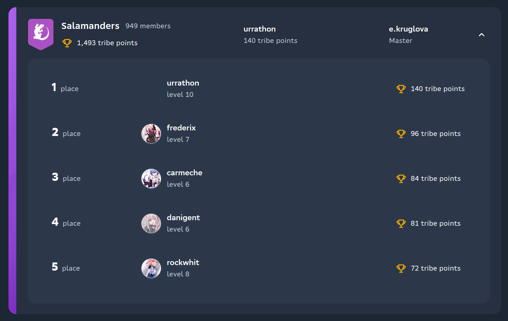

# s21plus

# Установка
[Последняя версия](https://github.com/s21toolkit/s21plus/raw/refs/heads/master/index.user.js)

# Функциональность

## Кнопка для копирования информации о проверке в календаре


Сохраняет в буфер обмена строку вида
```
LinuxMonitoring v1.0 26 January • 14:00 – 14:45 (maurinla)
```

> [!TIP]
> Полезно для выкладывания записей проверок на YouTube

## Moyai & Enchanted Nickname & Gravatar


## Фаллбек на rocketchat или nekos.best при отсутсвии граватара



> :warning: Лица были удалены с превью для избежания вопросов
